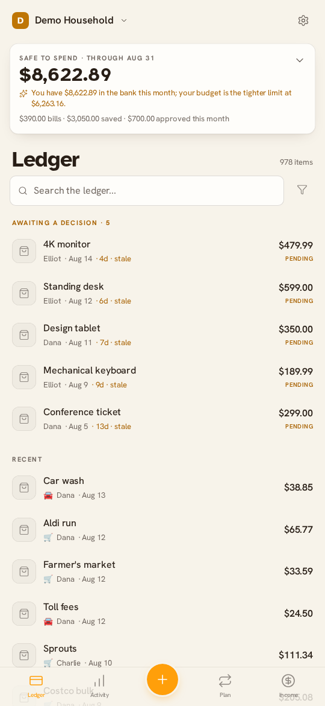
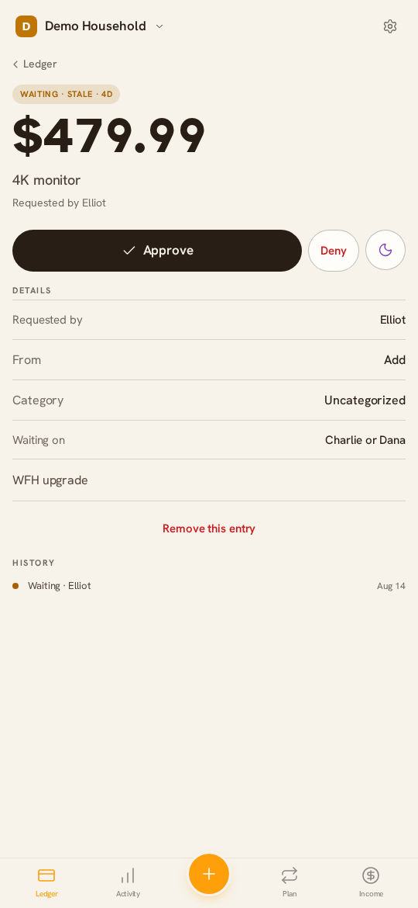
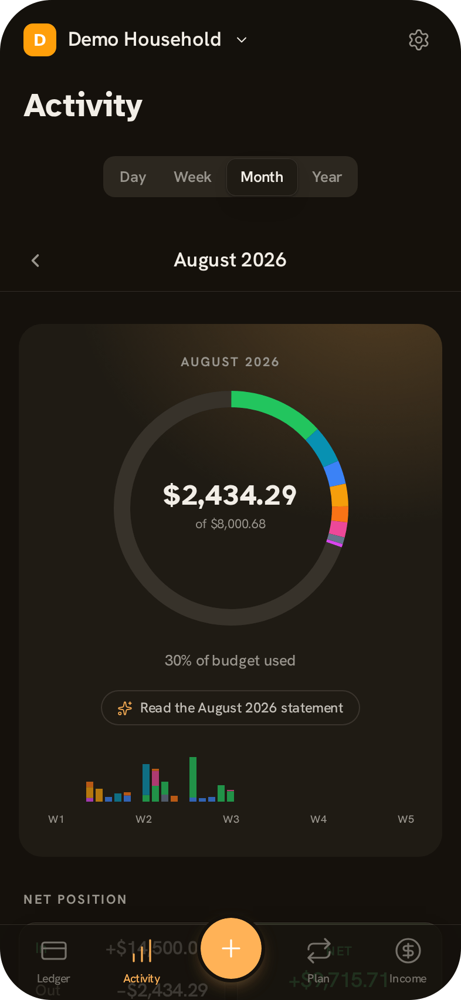
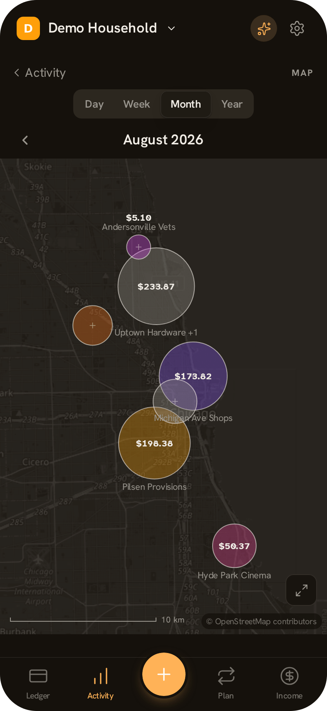

# Ledger

Self-hosted workspace budget & approval tracker. SvelteKit 2 (Svelte 5 runes) + Bun +
PostgreSQL 17 + Drizzle, auth via an external [Pocket ID](https://pocket-id.org) instance
(OIDC, passkeys only). Single app container + database behind your reverse proxy.

## Screenshots

> Add screenshots before release. Suggested subjects: the Ledger with Safe to Spend,
> an approval request, the Activity breakdown, the spending map.

|                                                           |                                                    |
| --------------------------------------------------------- | -------------------------------------------------- |
|  |  |
|       |           |

## Demo

<!-- Embed once recorded:
<video src="https://github.com/user-attachments/assets/VIDEO_ID" controls muted></video>
-->

> Add a demo video before release. Suggested flow: dictate a purchase, request
> approval, approve it from a partner's phone, check the month statement.

### Static demo build

The app also builds as a static site with no server and no database, for
GitHub Pages. It is the same app, not a mock: the real routes, use cases and
repositories run against Postgres compiled to WASM in the tab, over a seeded
snapshot. Excluded by construction: auth, the AI assistant, MCP, the API, and
anything else that needs a backend.

```bash
bun run db:start     # a local postgres, for building the seed only
bun run demo:seed    # seeds a throwaway db, dumps it into a PGlite snapshot
bun run demo:build   # generates .demo/routes, builds to build-demo/
bun run demo:preview # both of the above, then serves it
```

The demo ships the ledger, a purchase's detail and the new-purchase form,
buckets, income, analytics, the calendar, the month statement, recurring,
categories and the workspace overview. Left out because they need a backend:
auth, Harmony, MCP, the API, reconciliation, the map, CSV export and the
notification/member/model settings.

`demo:seed` reuses `scripts/seed-workspace.ts` unchanged, so the demo's data
cannot drift from the seeder the dev environment uses. `demo:build` generates a
parallel route tree at `.demo/routes` rather than touching `src/routes`; routes
enter the demo by being listed in `DEMO_ROUTES` in `scripts/demo-build.ts`, and
only once they have a `handlers.ts`.

Deploying to a project site (`user.github.io/repo`) needs the base path:

```bash
DEMO_BASE=/repo bun run demo:build
```

`bun run demo:build` finishes with `scripts/demo-finalize.ts`, which copies the
seed in, writes `404.html` (GitHub Pages serves it for any path it has no file
for, which is what makes deep links work), adds `.nojekyll`, and rewrites the
web manifest's `scope`, `start_url` and icons for the base path.

### Deploying it

`.github/workflows/demo.yml` builds and publishes to **Cloudflare Pages** on
every push to `main`, and on demand from the Actions tab.

The build runs in GitHub Actions rather than Cloudflare's Git integration
because the seed needs a real Postgres to migrate, seed and `pg_dump`, which a
Pages build container does not provide. Cloudflare only receives the finished
directory, uploaded with Wrangler — so the snapshot is rebuilt from the current
schema every run and never has to be committed.

One-time setup:

1. Cloudflare dashboard → **Workers & Pages** → **Create** → **Pages** →
   **Upload assets**, name the project `ledger-demo`, and create it. (The first
   real deploy comes from CI; this only reserves the name.)
2. **Custom domains** → add `ledger.pvi.sh`. The DNS record is created for you
   when the zone is already on Cloudflare.
3. Create an API token with the **Cloudflare Pages: Edit** permission.
4. In GitHub → Settings → Secrets and variables → Actions, add
   `CLOUDFLARE_API_TOKEN` and `CLOUDFLARE_ACCOUNT_ID`.

`DEMO_BASE` is left empty: the demo is served from the root of its own
subdomain, not a subpath.

`DEMO_HOST` decides how the client-routed app is served, and the two hosts
disagree in a way that is easy to get backwards:

|                        | fallback                               | note                                                          |
| ---------------------- | -------------------------------------- | ------------------------------------------------------------- |
| `cloudflare` (default) | `_redirects` with `/* /index.html 200` | a top-level `404.html` **disables** Cloudflare's SPA fallback |
| `github`               | `404.html`                             | GitHub Pages has no rewrite rules                             |

The workflow runs `check` and the unit tests before building, so a broken build
cannot replace a working demo. It deliberately does not run the e2e suite: that
needs Postgres, a fake identity provider and browsers, and belongs in its own
workflow.

Note that the demo is **public**. The seeded data is entirely fictional — the
generator invents every name, merchant and amount.

## Features

- **Workspaces.** Create or join via invite codes. Owner and member roles,
  per-member approval policies, workspace switcher.
- **The approval loop.** Log what you already spent, or ask first. Policies are
  never / above an amount / always, routed to any approver or one specific
  person. Overspending an approved amount or editing it sends it back for
  re-approval. Every decision is kept in an append-only audit log.
- **Gift mode (sealed purchases).** Hide a purchase from chosen people until a
  date. Hidden everywhere: lists, search, detail pages, and every aggregate is
  recomputed as if it did not exist, so nothing leaks by subtraction. The only
  seal-aware auto-approval path is disclosed in the audit log.
- **Images.** Content-addressed blob store with magic-byte validation, EXIF
  stripping, and WebP derivatives (originals discarded).
- **PWA & notifications.** Web Push (VAPID) and ntfy channels, per-member,
  per-event, per-channel preferences, iOS Add-to-Home-Screen onboarding.
- **Recurring charges.** A purpose-built RRULE subset (intervals, BYDAY,
  last-day-of-month) with timezone-correct times, capped catch-up after
  downtime, pause/resume/end, price changes for future occurrences, and
  auto-complete or confirm-at-actual-price. Recurring charges skip approval.
- **Buckets.** Per-member sinking funds on the same RRULE subset. Purchases can
  be charged to a bucket; an overdraft is allowed and counted as ordinary
  spending.
- **Analytics.** Computed on the fly and seal-filtered per viewer: month vs
  last-month comparison, daily trend, category and member breakdowns, monthly
  budgets overall and per category, net cash flow and savings rate.
- **Income.** One-off entries plus recurring templates expanded at query time.
  Income is workspace-open by design.
- **Safe to Spend.** A deterministic cash-flow read of the current month:
  income minus spent, approved, upcoming bills, and savings. The narration and
  alerts are interpretations of that arithmetic, nothing more.
- **Reconciliation.** Import a bank CSV or PDF and tick it against what is
  recorded. PDFs are parsed in the browser (pdf.js), so the document never
  leaves the device; only the date/amount/description columns are posted.
  Matching never guesses: ambiguous lines stay unmatched with a ranked
  shortlist for a person to pick from. Importing marks cleared lines and
  changes nothing else.
- **Optional AI assist.** A narrow `LlmAssist` port with a null adapter as the
  default, plus Ollama and OpenAI-compatible adapters. The model can only pick
  from option sets the caller already owns or transcribe glyphs for the app's
  own parsers; every output passes `domain/intelligence/constrain` or
  `read-fields` before it counts. A hallucination becomes an empty suggestion.
  Nothing it produces is written without a person confirming, and every surface
  degrades to its deterministic behavior with the assist off (the property the
  test suite pins down).
- **Command palette.** A local intent parser (no LLM) over spending questions,
  net-position questions, bucket creation, and navigation. With a model on, it
  can also answer open-ended questions over a computed briefing.
- **Places.** Optional per-purchase location, captured only on explicit tap,
  pasted map link (read offline), or typed address. Coordinates are stored as
  integer millidegrees (~110 m, which is not anonymity and the settings copy
  says so). A spending map with grid clustering in screen pixels; with no
  basemap configured it draws a plotted graticule instead of streets. Optional
  raster tiles are fetched by the server and re-served from this origin.
  There is deliberately no MCP write path for coordinates.
- **API & MCP.** Bearer tokens with read / log / approve scopes, and an MCP
  server so an assistant can query the workspace in plain language.

## Development

```sh
bun install
docker compose up -d db          # postgres 17 on :5432
bun scripts/dev-oidc.ts &        # fake OIDC provider on :9443 (dev only)
POCKET_ID_ISSUER=http://localhost:9443 \
POCKET_ID_CLIENT_ID=budget-local \
POCKET_ID_CLIENT_SECRET=dev-secret \
OIDC_REDIRECT_URI=http://localhost:5173/auth/callback \
bun run dev
```

The fake IdP auto-approves logins. Switch identities with
`curl http://localhost:9443/_as/bob` (alice / bob / carol).

- `bun run test` - domain unit tests (vitest)
- `bun run test:e2e` - Playwright: approval, sealing and places flows (needs the db container)
- `bun run seed` - demo workspace for the fake-IdP users
- `bun run check` - svelte-check
- `bun run lint` / `bun run format`
- `bun run db:generate` - create a migration after editing `src/lib/server/db/schema.ts`

Migrations run automatically on app boot (single-flight via Postgres advisory lock).

## Production

```sh
cp .env.example .env   # fill in Pocket ID + origin values
docker compose up -d --build
```

See `.env.example` for the full env contract. Notes:

- **Pocket ID issuer** is the instance's base URL, no trailing slash, no path.
- Create a **confidential** OIDC client in Pocket ID (Administration → OIDC Clients)
  and register `https://your-host/auth/callback` exactly.
- Blobs live in the `blobs` volume (`/data/blobs`); back up the DB first, then the
  blob dir (blobs are content-addressed and append-only, so that order is safe).
- **Basemap tiles are not a blob.** `TILE_CACHE_DIR` (`/data/tiles` by default)
  holds disposable third-party imagery keyed by coordinate, with a 30-day TTL.
  Do not back it up: it would carry hundreds of megabytes of somebody else's
  map into every archive. Deleting it at any time is safe.

## Backup & restore

```sh
# 1. Database first
docker compose exec db pg_dump -U root -Fc local > backup/budget-$(date +%F).dump
# 2. Then blobs (append-only, so dumping after the DB never strands a reference)
docker run --rm -v budget-app_blobs:/data/blobs -v "$PWD/backup:/backup" \
  alpine tar czf /backup/blobs-$(date +%F).tgz -C /data blobs

# Restore (reverse order is fine; blobs are content-addressed)
docker compose exec -T db pg_restore -U root -d local --clean < backup/budget-YYYY-MM-DD.dump
docker run --rm -v budget-app_blobs:/data/blobs -v "$PWD/backup:/backup" \
  alpine tar xzf /backup/blobs-YYYY-MM-DD.tgz -C /data
```

## Architecture

```
src/lib/domain/        pure TS, no I/O - money, purchase state machine,
                       approval policy evaluation, staleness, and the location
                       maths (Web Mercator, bubble clustering, map-link
                       parsing) - all unit-tested
src/lib/application/   use-cases: create/join workspace, submit/approve/deny/
                       cancel/complete/edit purchase (transactional + audit event),
                       recurring materialization, bucket accruals, budget alerts
src/lib/intelligence/  intent parser for the command palette (pure TS, no network)
src/lib/ports/         Clock, IdGenerator, Notifier, BlobStore, LlmAssist,
                       Geocoder (the last two default to null adapters - the app
                       is fully usable with neither configured); AppDeps and
                       AppContext, the composition root's output
src/lib/db/            schema and the `Db` type - the persistence port
src/lib/repo/          repositories over `Db` (every purchase read takes
                       workspaceId + viewerId); driver-agnostic, so the demo
                       runs them unchanged against Postgres-in-WASM
src/lib/demo/          the demo build's driven adapters: PGlite, in-memory
                       blobs, a null notifier, and the browser's context
src/lib/infra/         system clock, UUIDv7, filesystem blob store, image pipeline,
                       notifiers (web push, ntfy, composite), in-process SSE bus,
                       geocoding adapters
src/lib/actions/       Svelte actions - money input masking, use:submit, use:dismiss
src/lib/server/        things that genuinely need a server: env validation, the
                       postgres-js client, migrations, auth (OIDC, sessions),
                       rate limiting, basemap tile cache, MCP
src/routes/            thin routes; authorization resolved once in hooks.server.ts.
                       Converted routes keep their logic in a neutral handlers.ts
                       taking an AppContext, with +page.server.ts a few lines of
                       binding - the same handlers the demo build runs
```

The periodic sweep lives in `hooks.server.ts`: unseal due purchases, materialize
recurring rules and bucket accruals, send stale nudges and budget alerts. It runs
on boot and every 5 minutes, never overlapping itself, and stops on SIGTERM.
