# Ledger

**A self-hosted budget and approval tracker for the people you actually share money
with.** Ask before you buy, log what you spent, and see where it went. It runs on
your own server, on your own database, and it is built for a phone.

SvelteKit 2 (Svelte 5 runes), Bun, PostgreSQL 17 and Drizzle, with auth from an
external [Pocket ID](https://pocket-id.org) instance (OIDC, passkeys only). One app
container and a database behind your reverse proxy.

**[Try the live demo](https://ledger.pvi.sh)** with no signup. It is the real app
running Postgres compiled to WASM in your tab, over fictional seeded data.

|                                                                                                      |                                                                                                       |                                                                                                          |
| ---------------------------------------------------------------------------------------------------- | ----------------------------------------------------------------------------------------------------- | -------------------------------------------------------------------------------------------------------- |
|  |  | 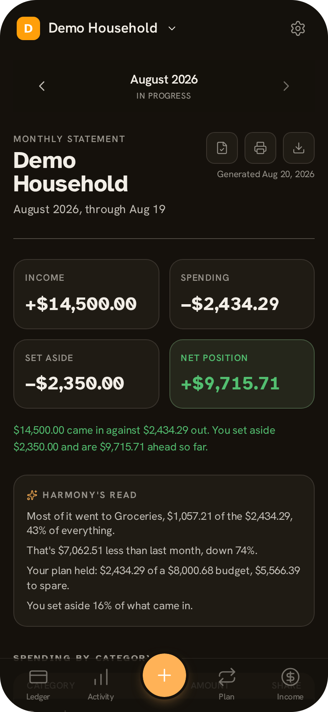 |

---

## Features

<table>
<tr>
<td width="270" valign="top"><br />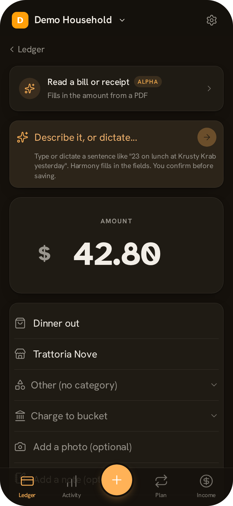<br /></td>
<td valign="top">

### Ask first, or log it after

Every purchase is either a request or a record. A member's policy decides which:
never needs approval, needs it above an amount, or always. Requests route to any
approver or to one named person.

Answering one is the thing this app is built around. A big amount, one gesture,
no form. Overspending an approved amount sends it back for re-approval, and so
does editing one. A denial is not the end: the person who asked can ask again
with a note, and an approver who said no can allow it after all. Every decision
lands in an append-only audit log.

</td>
</tr>
</table>

<table>
<tr>
<td width="270" valign="top">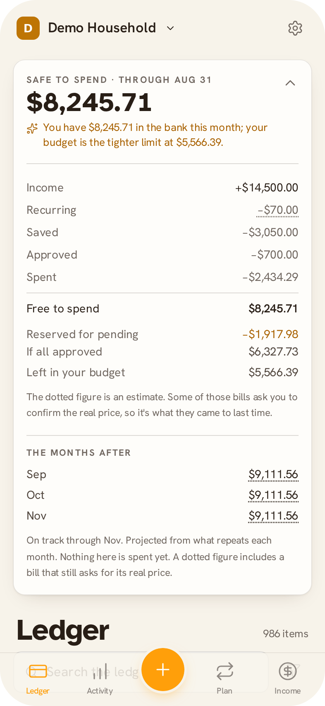</td>
<td valign="top">

### Safe to Spend

One number at the top of the ledger: what is actually free to spend this month.
It is income minus what has already gone out, what is approved but unpaid, the
bills still to come, and what you set aside.

Open it and the arithmetic unfolds line by line, because a number you cannot
check is a number you cannot trust. Underneath, the months after this one are
projected from what repeats. Nothing here is a guess by a model. It is addition,
and it shows its working.

It reads across a café from the next table, so it hides until you tap by default.

</td>
</tr>
</table>

<table>
<tr>
<td width="270" valign="top"><br /></td>
<td valign="top">

### Harmony

Ask a question in plain language and get an answer computed from your own data.
The parser is local, deterministic and ships with the app, so this works with no
model configured and no network call.

A language model is optional and deliberately boxed in. It can only pick from
option sets the app already owns, or transcribe glyphs for the app's own parsers.
It cannot approve a purchase, move money, or decide your Safe to Spend. Every
output is checked before it counts, so a hallucination becomes an empty
suggestion. Nothing it produces is saved without a person confirming it, and
every surface still works with the assist off.

Run it against a model on your own machine over Ollama, or any OpenAI-compatible
endpoint.

</td>
</tr>
</table>

<table>
<tr>
<td width="270" valign="top">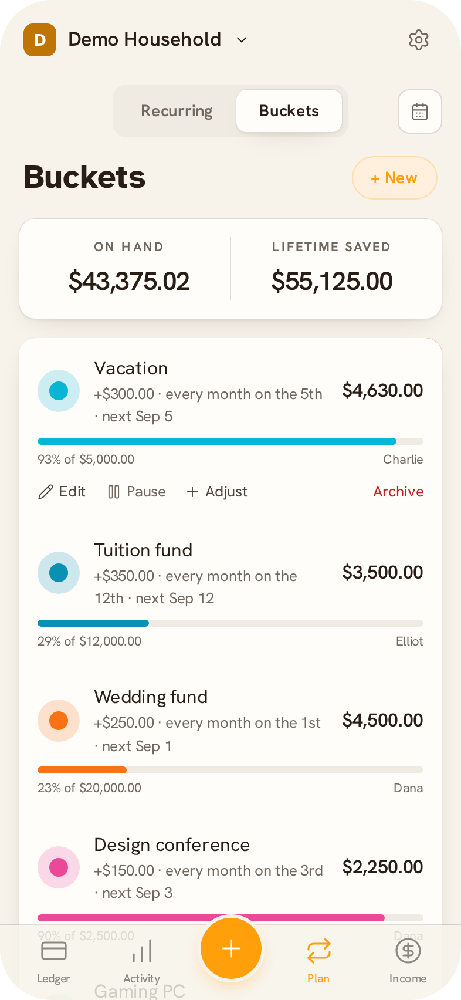<br />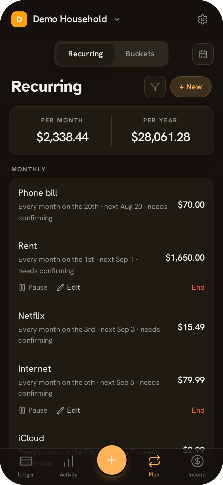<br />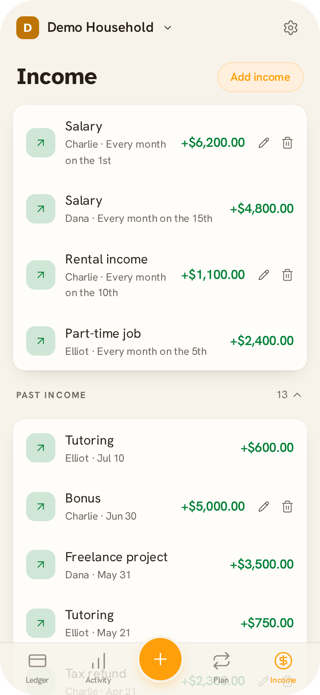<br />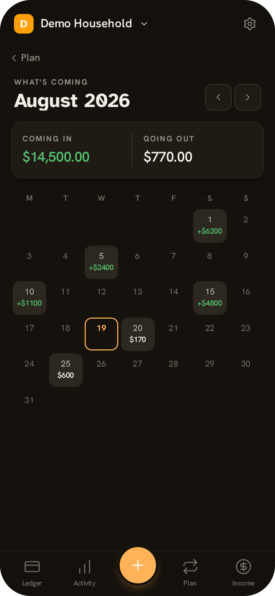</td>
<td valign="top">

### Plan what is coming

**Buckets** set money aside on a schedule, each owned by one person, each with a
goal. Charge a purchase to one and it comes out of that pot instead of this
month's spending. A bucket can name exactly who is allowed to charge it, which
is how an allowance works: a capped pot only its owner can spend, where going
over asks a parent first.

**Recurring charges** run on a purpose-built RRULE subset with timezone-correct
times, capped catch-up after downtime, and either auto-complete or
confirm-at-the-real-price.

**Income** takes one-off entries and repeating templates, expanded when you look
at them, with everything already received folded away below.

</td>
</tr>
</table>

<table>
<tr>
<td width="270" valign="top"><br />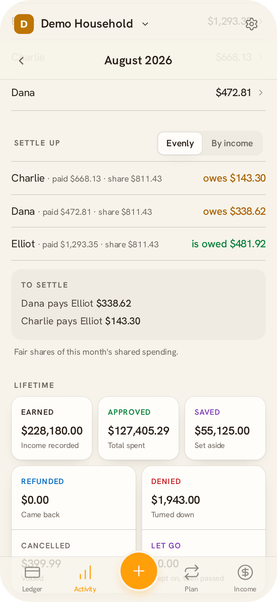<br /></td>
<td valign="top">

### See where it went

Every figure is computed on the fly and filtered for the person looking. Month
against last month, a daily trend, breakdowns by category and by member, and
budgets set overall or per category.

**Settle up** answers who owes whom: the period's shared spending split into fair
shares, evenly or weighted by what each person earned, and the transfers that
even it out.

The **monthly statement** totals the month and reads it back in plain language.

</td>
</tr>
</table>

<table>
<tr>
<td width="270" valign="top">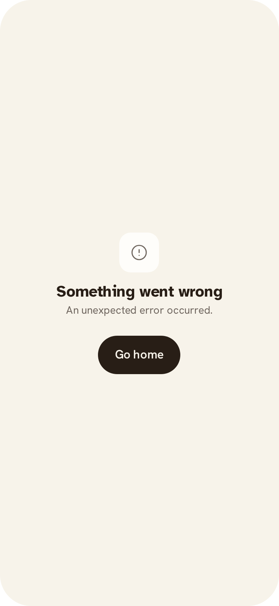</td>
<td valign="top">

### Reconcile against your bank

Import a CSV or a PDF and tick it against what is recorded. A PDF is parsed in
your browser, so the document never leaves the device: only the date, amount and
description columns are posted.

Matching never guesses. An ambiguous line stays unmatched with a ranked shortlist
for a person to choose from. Importing marks what has cleared and changes nothing
else, so a bank file can never rewrite your ledger.

</td>
</tr>
</table>

<table>
<tr>
<td width="270" valign="top">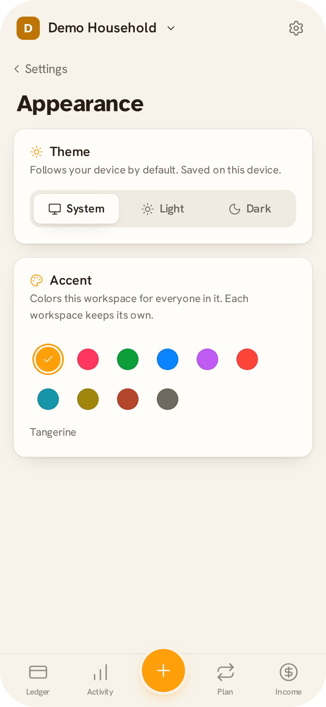<br />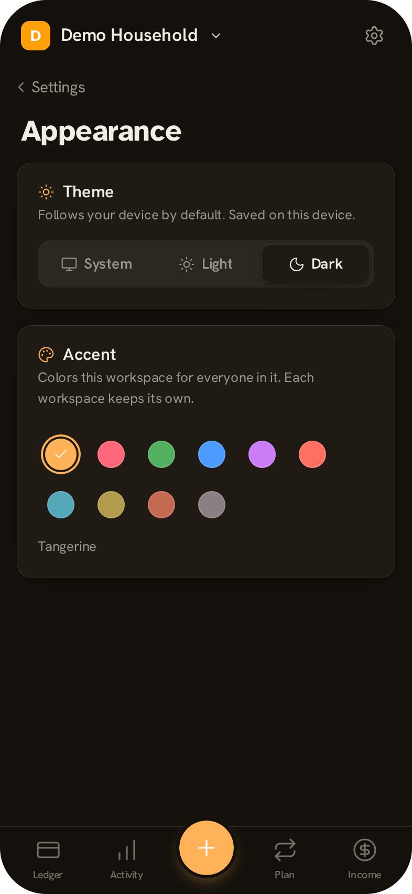<br />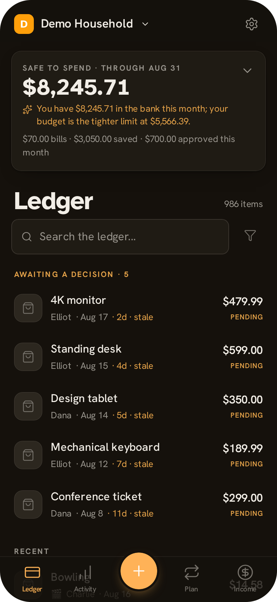<br />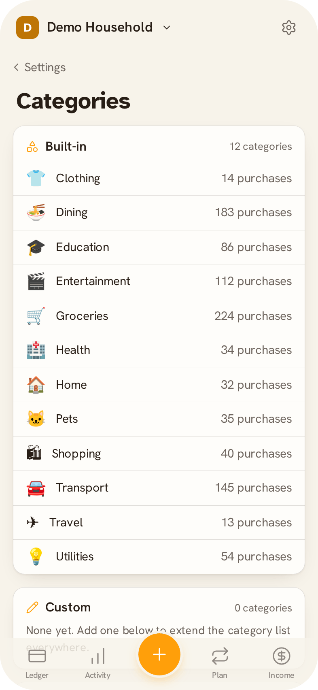</td>
<td valign="top">

### Make it yours

Light and dark, following the device by default, flipped before first paint so
there is no white flash. Eight workspace accents, and each workspace keeps its
own, so two households on one server never look alike.

Categories are yours to add, rename and retire. The built-in set is a starting
point.

</td>
</tr>
</table>

<table>
<tr>
<td width="270" valign="top">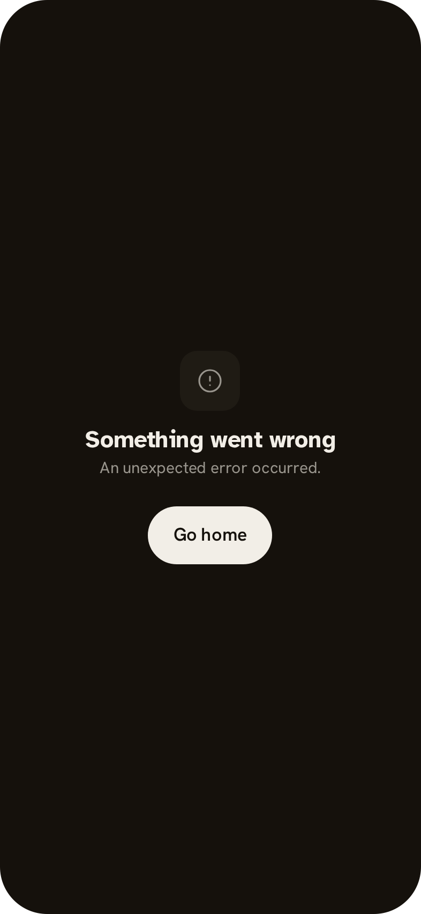</td>
<td valign="top">

### Connect an assistant

Bearer tokens with read, log and approve scopes, and an MCP server so Claude,
ChatGPT or your editor can query the workspace in plain language.

A token acts as its member. Approvals still apply to it, gift-mode seals still
hide from it, and a member capped to their own buckets is capped over the API
too. There is deliberately no write path for coordinates.

</td>
</tr>
</table>

<table>
<tr>
<td width="270" valign="top">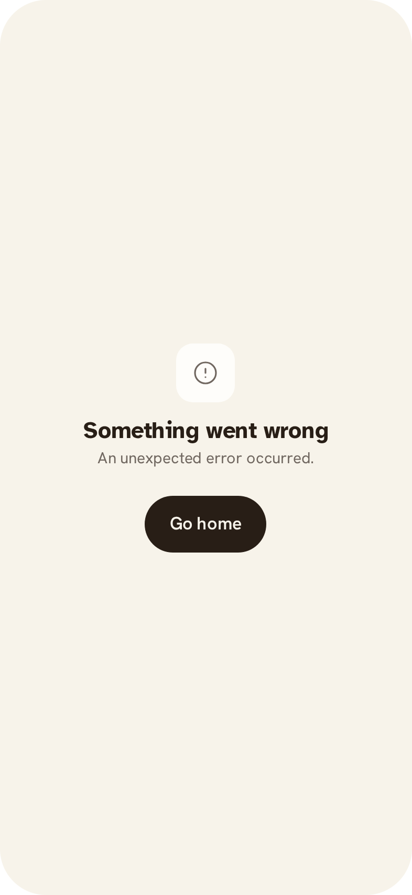</td>
<td valign="top">

### Notifications, and a real install

Web Push and ntfy, with per-member, per-event, per-channel routing. A channel
that cannot deliver is switched off rather than left tickable.

Installed to a home screen it behaves like an app: safe-area aware, offline
capable, its own window, with an install prompt that asks once and stays
answered. iPhone gets the Add to Home Screen path spelled out.

</td>
</tr>
</table>

### And the rest

- **Workspaces.** Create one or join with an invite code. Owner and member roles,
  per-member approval policies, and a switcher for people in more than one.
- **Gift mode.** Hide a purchase from chosen people until a date. It is hidden
  everywhere: lists, search, detail pages, and every total is recomputed as though
  it did not exist, so nothing leaks by subtraction. The one path that can
  auto-approve a sealed purchase says so in the audit log.
- **Images.** A content-addressed blob store with magic-byte validation, EXIF
  stripping and WebP derivatives. Originals are discarded.
- **Places.** Optional per-purchase location, captured only when you tap, paste a
  map link (read offline) or type an address. Coordinates are stored as integer
  millidegrees, roughly 110 m, which is not anonymity and the settings copy says
  so. The spending map clusters in screen pixels and draws a plotted graticule
  when no basemap is configured. Tiles are fetched by the server and re-served
  from this origin, so your browser never talks to the tile provider.
- **Command palette.** A local intent parser over spending questions, net
  position, bucket creation and navigation. No model required.

---

## The static demo

The app also builds as a static site with no server and no database, for
GitHub Pages. It is the same app, not a mock: the real routes, use cases and
repositories run against Postgres compiled to WASM in the tab, over a seeded
snapshot. Excluded by construction: auth, the AI assistant, MCP, the API, and
anything else that needs a backend.

```bash
bun run db:start     # a local postgres, for building the seed only
bun run demo:seed    # seeds a throwaway db, dumps it into a PGlite snapshot
bun run demo:build   # generates .demo/routes, builds to build-demo/
bun run demo:preview # both of the above, then serves it
```

The demo ships the ledger, a purchase's detail and the new-purchase form,
buckets, income, analytics, the calendar, the month statement, recurring,
categories, appearance and the workspace overview. Left out because they need a
backend: auth, Harmony, MCP, the API, reconciliation, the map, CSV export and
the notification/member/model settings.

`demo:seed` reuses `scripts/seed-workspace.ts` unchanged, so the demo's data
cannot drift from the seeder the dev environment uses. `demo:build` generates a
parallel route tree at `.demo/routes` rather than touching `src/routes`; routes
enter the demo by being listed in `DEMO_ROUTES` in `scripts/demo-build.ts`, and
only once they have a `handlers.ts`.

Deploying to a project site (`user.github.io/repo`) needs the base path:

```bash
DEMO_BASE=/repo bun run demo:build
```

`bun run demo:build` finishes with `scripts/demo-finalize.ts`, which copies the
seed in, writes `404.html` (GitHub Pages serves it for any path it has no file
for, which is what makes deep links work), adds `.nojekyll`, and rewrites the
web manifest's `scope`, `start_url` and icons for the base path.

### Deploying it

`.github/workflows/demo.yml` builds and publishes to **Cloudflare Pages** on
every push to `main`, and on demand from the Actions tab.

The build runs in GitHub Actions rather than Cloudflare's Git integration
because the seed needs a real Postgres to migrate, seed and `pg_dump`, which a
Pages build container does not provide. Cloudflare only receives the finished
directory, uploaded with Wrangler, so the snapshot is rebuilt from the current
schema every run and never has to be committed.

One-time setup:

1. Cloudflare dashboard → **Workers & Pages** → **Create** → **Pages** →
   **Upload assets**, name the project `ledger-demo`, and create it. (The first
   real deploy comes from CI; this only reserves the name.)
2. **Custom domains** → add `ledger.pvi.sh`. The DNS record is created for you
   when the zone is already on Cloudflare.
3. Create an API token with the **Cloudflare Pages: Edit** permission.
4. In GitHub → Settings → Secrets and variables → Actions, add
   `CLOUDFLARE_API_TOKEN` and `CLOUDFLARE_ACCOUNT_ID`.

`DEMO_BASE` is left empty: the demo is served from the root of its own
subdomain, not a subpath.

`DEMO_HOST` decides how the client-routed app is served, and the two hosts
disagree in a way that is easy to get backwards:

|                        | fallback                               | note                                                          |
| ---------------------- | -------------------------------------- | ------------------------------------------------------------- |
| `cloudflare` (default) | `_redirects` with `/* /index.html 200` | a top-level `404.html` **disables** Cloudflare's SPA fallback |
| `github`               | `404.html`                             | GitHub Pages has no rewrite rules                             |

The workflow runs `check` and the unit tests before building, so a broken build
cannot replace a working demo. It deliberately does not run the e2e suite: that
needs Postgres, a fake identity provider and browsers, and belongs in its own
workflow.

Note that the demo is **public**. The seeded data is entirely fictional: the
generator invents every name, merchant and amount.

---

## Development

```sh
bun install
docker compose up -d db          # postgres 17 on :5432
bun scripts/dev-oidc.ts &        # fake OIDC provider on :9443 (dev only)
POCKET_ID_ISSUER=http://localhost:9443 \
POCKET_ID_CLIENT_ID=budget-local \
POCKET_ID_CLIENT_SECRET=dev-secret \
OIDC_REDIRECT_URI=http://localhost:5173/auth/callback \
bun run dev
```

The fake IdP auto-approves logins. Switch identities with
`curl http://localhost:9443/_as/bob` (alice / bob / carol).

- `bun run test` - domain unit tests (vitest)
- `bun run test:e2e` - Playwright: approval, sealing and places flows (needs the db container)
- `bun run seed` - demo workspace for the fake-IdP users
- `bun run check` - svelte-check
- `bun run lint` / `bun run format`
- `bun run db:generate` - create a migration after editing `src/lib/server/db/schema.ts`

### Screenshots

The images in this file and in the install sheet are committed output, rerun on
redesign rather than on every build. The capture happens in two passes, because
they need different things:

```sh
# 1. Everything the demo can render. Needs only this repo, and is reproducible.
bun run demo:build && bun scripts/capture-screenshots.ts

# 2. The pages that need a server behind them: Harmony, AI assist, members,
#    reconcile, API and notifications. Needs a seeded database and DEV_MODE.
DEV_MODE=true bun run dev &
CAPTURE_SERVER_WS=<slug> bun scripts/capture-screenshots.ts --server http://localhost:5173
```

Pass one alone leaves the server-only images untouched and says so. Both write
full-bleed PNGs to `static/screenshots/` for the web manifest, and the same
shots with the phone's corner radius to `docs/screenshots/` for this file. The
manifest's screenshot list is generated from the same array that drives the
capture, so the two cannot drift.

Migrations run automatically on app boot (single-flight via Postgres advisory lock).

## Production

```sh
cp .env.example .env   # fill in Pocket ID + origin values
docker compose up -d --build
```

See `.env.example` for the full env contract. Notes:

- **Pocket ID issuer** is the instance's base URL, no trailing slash, no path.
- Create a **confidential** OIDC client in Pocket ID (Administration → OIDC Clients)
  and register `https://your-host/auth/callback` exactly.
- Blobs live in the `blobs` volume (`/data/blobs`); back up the DB first, then the
  blob dir (blobs are content-addressed and append-only, so that order is safe).
- **Basemap tiles are not a blob.** `TILE_CACHE_DIR` (`/data/tiles` by default)
  holds disposable third-party imagery keyed by coordinate, with a 30-day TTL.
  Do not back it up: it would carry hundreds of megabytes of somebody else's
  map into every archive. Deleting it at any time is safe.

## Backup & restore

```sh
# 1. Database first
docker compose exec db pg_dump -U root -Fc local > backup/budget-$(date +%F).dump
# 2. Then blobs (append-only, so dumping after the DB never strands a reference)
docker run --rm -v budget-app_blobs:/data/blobs -v "$PWD/backup:/backup" \
  alpine tar czf /backup/blobs-$(date +%F).tgz -C /data blobs

# Restore (reverse order is fine; blobs are content-addressed)
docker compose exec -T db pg_restore -U root -d local --clean < backup/budget-YYYY-MM-DD.dump
docker run --rm -v budget-app_blobs:/data/blobs -v "$PWD/backup:/backup" \
  alpine tar xzf /backup/blobs-YYYY-MM-DD.tgz -C /data
```

## Architecture

```
src/lib/domain/        pure TS, no I/O - money, purchase state machine,
                       approval policy evaluation, staleness, and the location
                       maths (Web Mercator, bubble clustering, map-link
                       parsing) - all unit-tested
src/lib/application/   use-cases: create/join workspace, submit/approve/deny/
                       cancel/complete/edit purchase (transactional + audit event),
                       recurring materialization, bucket accruals, budget alerts
src/lib/intelligence/  intent parser for the command palette (pure TS, no network)
src/lib/ports/         Clock, IdGenerator, Notifier, BlobStore, LlmAssist,
                       Geocoder (the last two default to null adapters - the app
                       is fully usable with neither configured); AppDeps and
                       AppContext, the composition root's output
src/lib/db/            schema and the `Db` type - the persistence port
src/lib/repo/          repositories over `Db` (every purchase read takes
                       workspaceId + viewerId); driver-agnostic, so the demo
                       runs them unchanged against Postgres-in-WASM
src/lib/demo/          the demo build's driven adapters: PGlite, in-memory
                       blobs, a null notifier, and the browser's context
src/lib/infra/         system clock, UUIDv7, filesystem blob store, image pipeline,
                       notifiers (web push, ntfy, composite), in-process SSE bus,
                       geocoding adapters
src/lib/actions/       Svelte actions - money input masking, use:submit, use:dismiss
src/lib/server/        things that genuinely need a server: env validation, the
                       postgres-js client, migrations, auth (OIDC, sessions),
                       rate limiting, basemap tile cache, MCP
src/routes/            thin routes; authorization resolved once in hooks.server.ts.
                       Converted routes keep their logic in a neutral handlers.ts
                       taking an AppContext, with +page.server.ts a few lines of
                       binding - the same handlers the demo build runs
```

The periodic sweep lives in `hooks.server.ts`: unseal due purchases, materialize
recurring rules and bucket accruals, send stale nudges and budget alerts. It runs
on boot and every 5 minutes, never overlapping itself, and stops on SIGTERM.
